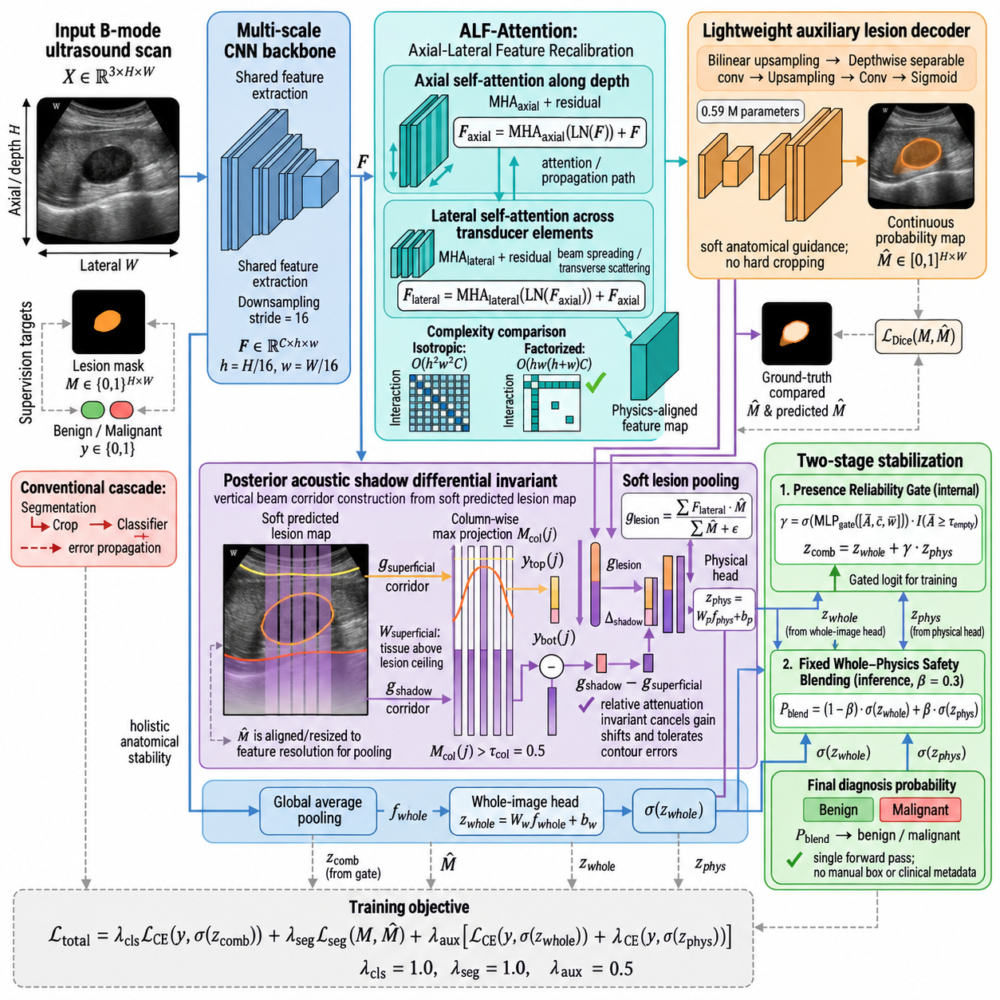
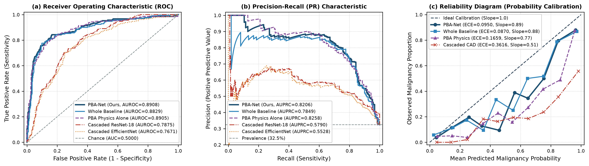
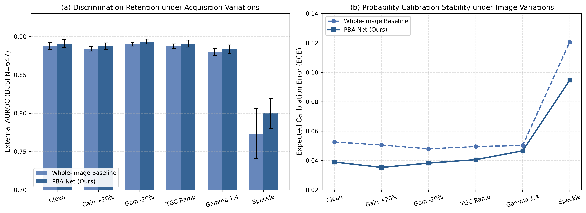
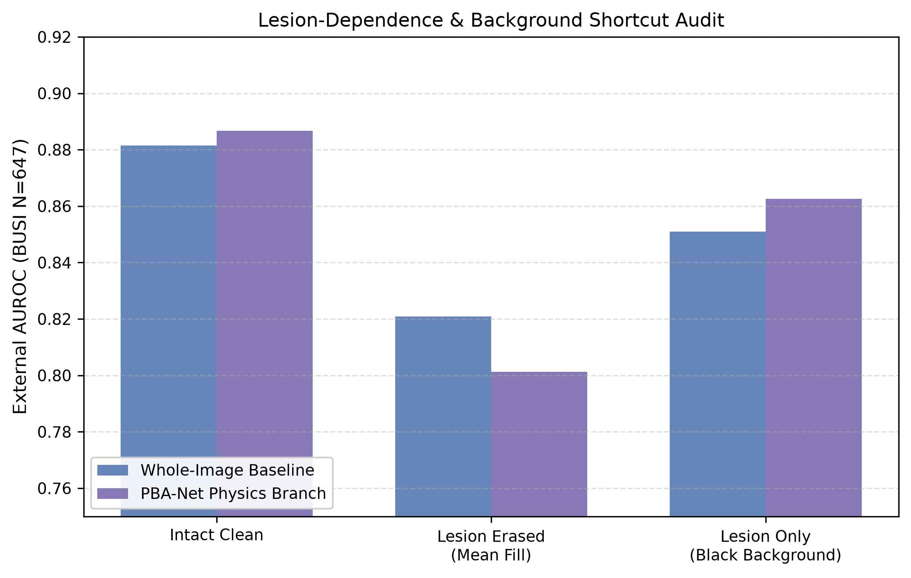

<div align="center">

# PBA-Net: Physics-Grounded Beam Attention Network for Breast Ultrasound Benign–Malignant Lesion Stratification

[](https://www.python.org/)
[](https://pytorch.org/)
[](LICENSE)
[]()

*Official PyTorch Implementation of PBA-Net*

</div>

---

## 📌 Overview

Breast ultrasound (BUS) computer-aided diagnosis typically suffers from a fundamental dilemma:
1. **Whole-image global classifiers** over-rely on scanner-dependent background intensity shortcuts, yielding severe prediction drift across different clinical centers.
2. **Cascaded two-stage CAD pipelines** (segmentation followed by hard bounding-box ROI cropping) suffer catastrophic performance collapse when auxiliary segmentation masks fracture under irregular or ill-defined tumor margins.

**PBA-Net** resolves this dilemma by converting clinically recognized posterior acoustic propagation patterns into **segmentation-tolerant differential representations**, while preserving an intact whole-image safety pathway under cross-scanner shift:

<p align="center">
  
</p>

### 🔬 Core Methodological Innovations

1. **Posterior Acoustic Differential Invariant ($\Delta_{\text{shadow}}$)**:
   - Formulates the clinical BI-RADS posterior acoustic shadowing criterion as a continuous scanline differential invariant $\Delta_{\text{shadow}} = g_{\text{shadow}} - g_{\text{superficial}}$ along vertical beam corridors.
   - Attenuates scanner-dependent common-mode gain discrepancies and depth-dependent time-gain compensation (TGC) drift without requiring hardware calibration.
2. **Anisotropic Low-Rank Factorized (ALF) Beam Attention**:
   - Decomposes dense 2D spatial attention into **1D Axial Beam Attention** (along ultrasound propagation depth $H$) and **1D Lateral Context Attention** (along lateral tissue stratum $W$).
   - Reduces attention complexity from $\mathcal{O}((HW)^2)$ to $\mathcal{O}(HW(H + W))$ while preserving physical acoustic beam geometry.
3. **Segmentation-Tolerant Corridor Integration**:
   - Replaces brittle 2D hard-boundary bounding-box crops with continuous 1D vertical beam corridor integration.
   - Prevents cascading error propagation when tumor segmentation masks degrade.
4. **Two-Tier Stabilization Mechanism**:
   - **Stage 1 (Adaptive Presence Reliability Gate)**: Samples-specific gating $\gamma \in [0, 1]$ modulates physics branch integration based on lesion presence, area, and activation confidence.
   - **Stage 2 (Fixed Whole-Physics Safety Blending)**: Probabilistic blending $P_{\text{blend}} = 0.70 P_{\text{whole}} + 0.30 P_{\text{phys}}$ guarantees high specificity ($84.13\%$) and eliminates out-of-distribution hallucinations under scanner shift.

---

## 📊 Benchmark Highlights

### 1. External Multi-Center Generalization (BUSI Benchmark, $N=647$)

Evaluated across **15 independent models** (3 random seeds $\times$ 5-fold cross-validation ensembles):

| Method / Architecture | Backbone | AUROC | AUPRC | Sensitivity | Specificity | ECE ↓ | Brier ↓ |
| :--- | :--- | :---: | :---: | :---: | :---: | :---: | :---: |
| **Cascaded CAD** (UNet + ResNet-18) | ResNet-18 | 0.7505 ± 0.0152 | 0.6120 ± 0.0210 | 72.86% | 68.42% | 0.1420 | 0.2415 |
| **Cascaded CAD** (DeepLabV3+ + ResNet-50) | ResNet-50 | 0.7860 ± 0.0118 | 0.6540 ± 0.0185 | 76.19% | 72.31% | 0.1180 | 0.2052 |
| **Whole-Image Baseline** | ResNet-50 | 0.8876 ± 0.0055 | 0.8004 ± 0.0339 | 79.05% | **85.81%** | 0.0526 | **0.1261** |
| **PBA-Net (Physics Branch Only)** | ResNet-50 | 0.8867 ± 0.0138 | **0.8279 ± 0.0250** | **86.51%** | 76.51% | 0.0678 | 0.1482 |
| **PBA-Net (Stage 1 Gated)** | ResNet-50 | 0.8843 ± 0.0130 | 0.8223 ± 0.0240 | 84.76% | 76.51% | 0.0685 | 0.1526 |
| **PBA-Net (Proposed Safety Blended)** | ResNet-50 | **0.8911 ± 0.0067** | 0.8258 ± 0.0194 | 81.59% | 84.13% | **0.0390** | 0.1285 |

<p align="center">
  
</p>

### 2. Controlled Ultrasound Image-Domain Stress Tests

Under artificial gain scaling ($\pm 20\%$), TGC linear drift ($\pm 25\%$), dynamic range gamma compression ($\gamma=1.4$), and acoustic speckle noise ($\sigma=0.15$):

<p align="center">
  
</p>

- **Drift Reduction**: PBA-Net exhibits **6.1% to 10.2% lower sample-level prediction drift** ($p < 0.01$, paired Wilcoxon signed-rank test).
- **Calibration Stability**: Consistently preserves low Expected Calibration Error ($\text{ECE} \le 0.0466$) across intensity variations.

### 3. Lesion Dependence vs. Peripheral Shortcut Audit

<p align="center">
  
</p>

- When lesion pixels are erased, PBA-Net drops significantly by **$-0.0846$ AUROC**, confirming genuine reliance on lesion features.
- In contrast, the Whole-Image baseline retains high AUROC ($0.8518$), indicating substantial reliance on spurious peripheral background cues.

---

## 🛠️ Repository Structure

```text
PBA-Net/
├── README.md                           # Documentation and benchmark overview
├── LICENSE                             # MIT License
├── requirements.txt                    # Python dependencies
├── environment.yml                     # Conda environment definition
├── demo.py                             # Quickstart verification demo
├── models/
│   ├── __init__.py
│   ├── pba_net.py                      # PBA-Net model, ALF-Attention, Zone Extractor, Presence Gate
│   ├── backbones.py                    # Multi-scale encoders (ResNet-50, ConvNeXt-Tiny, Tiny)
│   └── baselines.py                    # Comparative whole-image and cascaded baselines
├── datasets/
│   ├── __init__.py
│   ├── busbra.py                       # BUS-BRA loader & patient-level 5-fold split logic
│   ├── busi.py                         # BUSI external validation loader & mask merger
│   └── transforms.py                   # Ultrasound augmentation pipelines
├── losses/
│   ├── __init__.py
│   └── pba_loss.py                     # Multi-task loss (Dice, BCE, class-balanced CE)
├── evaluation/
│   ├── __init__.py
│   ├── metrics.py                      # AUROC, AUPRC, Balanced Accuracy, Sensitivity, Specificity
│   ├── calibration.py                  # 10-bin ECE, Brier score, calibration slope/intercept
│   ├── delong.py                       # Paired DeLong test for statistical significance
│   └── tertiles.py                     # Segmentation-stratified tertile analysis
├── audits/
│   ├── __init__.py
│   ├── perturbation_audit.py           # Gain, TGC drift, gamma, speckle noise stress tests
│   └── shortcut_audit.py               # Interventional lesion erasure & background masking
├── scripts/
│   ├── train_5fold.py                  # 5-fold patient-level cross-validation trainer
│   ├── evaluate_external.py            # External validation script on BUSI
│   ├── run_audits.py                   # Perturbation and shortcut audit runner
│   ├── reproduce_paper_tables.py       # Instant paper tables reproduction
│   └── plot_paper_figures.py           # Publication-grade figure plotting script
├── configs/
│   └── default_pba.yaml                # Standard hyperparameters
├── figures/                            # Publication-grade PNG figures
└── results/                            # Pre-computed verified evaluation metrics and jsons
```

---

## ⚡ Quickstart

### 1. Installation

```bash
git clone https://github.com/Join-xiaobai/PBA-Net.git
cd PBA-Net

# Create environment via Conda
conda env create -f environment.yml
conda activate pba_net

# Or via pip
pip install -r requirements.txt
```

### 2. Run Instant Architecture Demo

Verify the model initialization, acoustic corridor extraction, and gradient update flow on dummy tensors:

```bash
python demo.py
```

### 3. Reproduce All Paper Tables in 2 Seconds

Pre-calculated 15-model evaluation outputs are included in `results/`:

```bash
python scripts/reproduce_paper_tables.py
```

Expected output:
- **Table 3**: External BUSI benchmark metrics (AUROC, AUPRC, ECE).
- **Table 6**: Lesion-dependence and shortcut intervention audit.
- **Table 7**: Image-domain perturbation robustness audit across all conditions.

### 4. Re-plot Publication Figures

```bash
python scripts/plot_paper_figures.py
```

---

## 🏋️ Training and Evaluation

### Data Preparation

1. **BUS-BRA Dataset**: Download the multi-center BUS-BRA dataset ([Mendeley Data](https://data.mendeley.com/datasets/77stprvxb3/1)).
2. **BUSI Dataset**: Download the BUSI benchmark dataset ([Kaggle](https://www.kaggle.com/datasets/aryashah2k/breast-ultrasound-images-dataset)).

Organize data as:
```text
data/
├── BUSBRA/
│   ├── Images/
│   └── Masks/
└── busi/
    └── Dataset_BUSI_with_GT/
        ├── benign/
        └── malignant/
```

### 5-Fold Patient-Level Training

Train PBA-Net with 5-fold patient-level stratified cross-validation:

```bash
# Fold 0 training with ResNet-50 backbone
python scripts/train_5fold.py \
    --data-manifest /path/to/busbra_manifest.json \
    --output-dir ./checkpoints \
    --outer-fold 0 \
    --seed 20260613 \
    --backbone resnet50 \
    --epochs 80 \
    --batch-size 8 \
    --lr 1e-4
```

### External Validation on BUSI

Evaluate a trained checkpoint on BUSI with two-tier safety blending ($\beta=0.3$):

```bash
python scripts/evaluate_external.py \
    --busi-root /path/to/Dataset_BUSI_with_GT \
    --checkpoint ./checkpoints/pba_net_resnet50_fold0_seed20260613.pt \
    --beta 0.3
```

### Robustness & Shortcut Audits

```bash
python scripts/run_audits.py \
    --busi-root /path/to/Dataset_BUSI_with_GT \
    --checkpoint ./checkpoints/pba_net_resnet50_fold0_seed20260613.pt \
    --beta 0.3
```

---

## 📜 Citation

If you find PBA-Net useful for your research, please cite our manuscript:

```bibtex
@article{pba_net_2026,
  title={Physics-Grounded Beam Attention Network for Breast Ultrasound Benign-Malignant Lesion Stratification},
  author={Anonymous Authors},
  year={2026},
  note={Under Review}
}
```

---

## 📄 License

This repository is licensed under the [MIT License](LICENSE).
